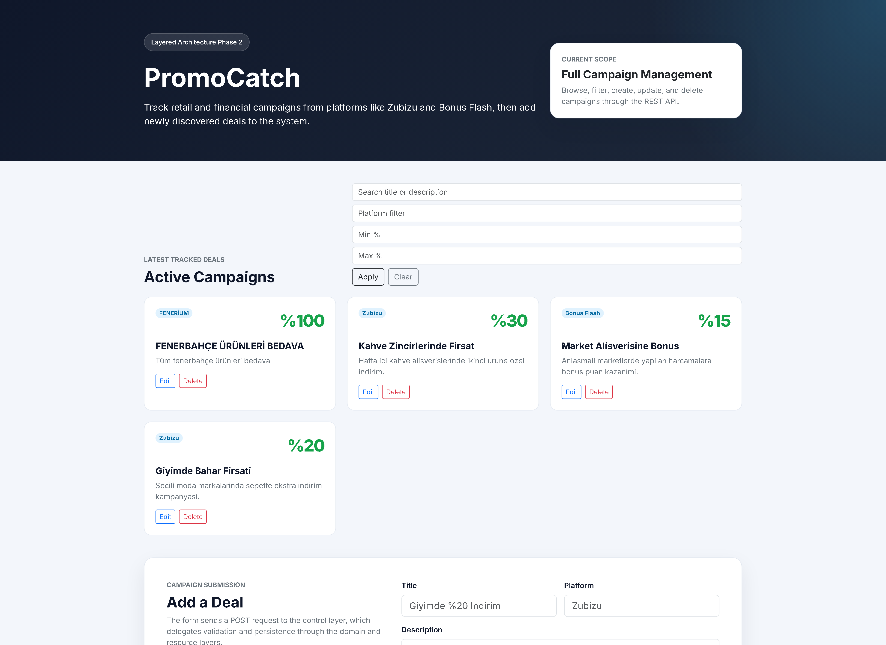

# PromoCatch

PromoCatch is a campaign and deal tracking system developed for a Software Architecture course project.  
The project is organized in two phases and follows a layered REST API architecture.



## Overview

PromoCatch helps users:

- browse active campaigns
- search and filter deals
- create new campaign records
- update or delete existing campaigns

The final version of the project is available in:

```text
phase2/
```

## Repository Structure

- `phase1/`: Phase 1 submission with SAD V1 and the initial implementation
- `phase2/`: Final Phase 2 submission with SAD V2, full implementation, screenshots, and presentation files

## Recommended Review Path

If you are evaluating the final project, use this order:

1. Open `phase2/README.md`
2. Review `phase2/docs/SAD_Phase2.md` or `phase2/docs/SAD_Phase2.pdf`
3. Run the local application from `phase2/`

## Quick Start

For the final version of the project, see:

```text
phase2/README.md
```

Windows users can run the final version from `phase2/` with:

- `run_local.bat`
- `run_local.ps1`

## Architecture

The project follows a layered architecture:

- Presentation Layer
- Control Layer
- Domain Layer
- Resource Layer

## Deliverables

The repository includes:

- Phase 1 and Phase 2 source code
- SAD documentation
- screenshots
- presentation files
- Docker deployment files
