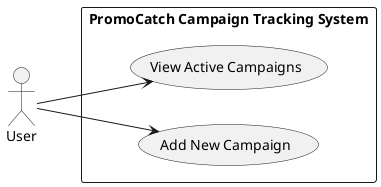
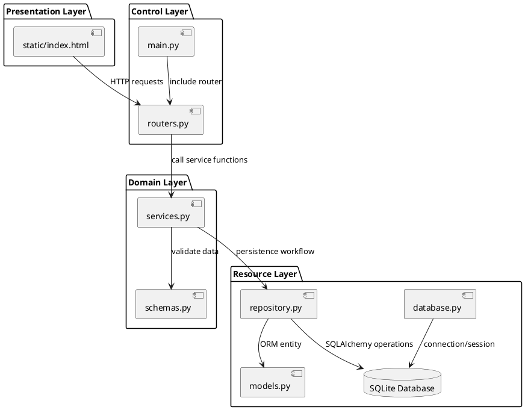
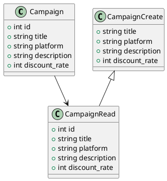
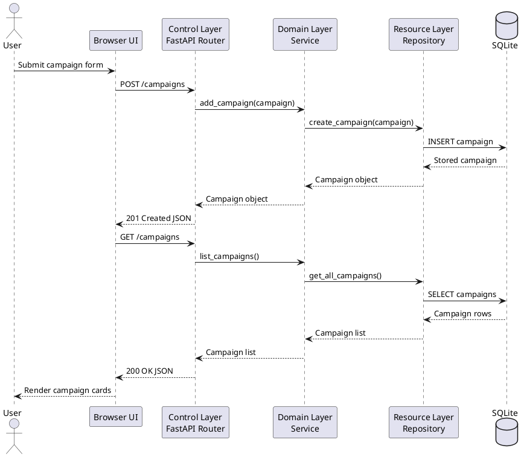
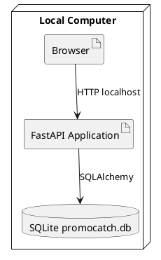

# Software Architecture Document V1

## Project Information

Project name: **PromoCatch - Campaign and Deal Tracking System**

Course context: **Software Architecture Project**

Phase: **Phase 1 - Architecture Design and Initial Implementation**

Deadline: **04.05.2026**

Architecture style: **Layered Architecture with REST API**

Technology stack:

- Backend: Python, FastAPI, SQLAlchemy
- Database: SQLite
- Frontend: HTML, CSS, Bootstrap, Vanilla JavaScript

## Phase 1 Step 1: System Selection

### Target System

PromoCatch is a campaign and deal tracking system. It focuses on retail and financial promotions from platforms such as Zubizu and Bonus Flash. The system helps users see current opportunities and add newly discovered campaigns to a central list.

### System Purpose

The purpose of PromoCatch is to collect campaign information in one simple web application. Users can quickly review active promotions and contribute new deals when they find them.

### Users

- **Visitor/User**: Views active campaigns and adds new campaign records.
- **System**: Validates submitted campaign data, stores it in SQLite, and returns campaign data through REST endpoints.

### Main Functionalities

- List active campaigns.
- Add a new campaign with title, platform, description, and discount rate.
- Store campaigns persistently in SQLite.
- Expose backend functionality through REST API endpoints.
- Provide a partial user interface for Phase 1 use cases.

## Phase 1 Step 2: SAD V1

### Architectural Decision

PromoCatch applies a strict layered architecture. The layers are separated as follows:

- **Presentation Layer**: `static/index.html`
- **Control Layer**: `main.py`, `routers.py`
- **Domain Layer**: `schemas.py`, `services.py`
- **Resource Layer**: `database.py`, `models.py`, `repository.py`

The presentation layer communicates with the backend using HTTP requests. The router receives requests and delegates them to the service layer. The service layer handles business workflow and validation models. The repository layer performs database operations.

## 4+1 Architectural Views for Phase 1

### 1. Use Case View

The Phase 1 use case is **Track and Add Campaigns**.

Use cases:

- **View Active Campaigns**: The user opens the web page and sees campaigns retrieved from the backend.
- **Add New Campaign**: The user fills in the form and submits a new campaign.

Main flow:

1. The user opens PromoCatch in the browser.
2. The frontend sends `GET /campaigns`.
3. The backend returns active campaigns as JSON.
4. The user enters a new campaign in the Add a Deal form.
5. The frontend sends `POST /campaigns`.
6. The backend validates and stores the campaign.
7. The frontend refreshes the campaign list.

Use case diagram:



Partial UI implementation:

```html
<section class="mb-5">
  <h2 class="fw-bold mb-0">Active Campaigns</h2>
  <div class="row g-4" id="campaignList"></div>
</section>

<form id="campaignForm" class="row g-3">
  <input id="title" name="title" type="text" required>
  <input id="platform" name="platform" type="text" required>
  <textarea id="description" name="description" required></textarea>
  <input id="discount_rate" name="discount_rate" type="number" required>
  <button type="submit">Add Campaign</button>
</form>
```

Related frontend behavior:

```javascript
const response = await fetch("/campaigns");
const campaigns = await response.json();

await fetch("/campaigns", {
  method: "POST",
  headers: { "Content-Type": "application/json" },
  body: JSON.stringify(payload),
});
```

### 2. Logical View

The logical view presents the static structure of the system. PromoCatch is organized into four software layers.

Layer responsibilities:

- **Presentation Layer**: Displays campaign cards and sends REST requests.
- **Control Layer**: Defines API endpoints and routes requests to services.
- **Domain Layer**: Defines validation schemas and business operations.
- **Resource Layer**: Defines database models and persistence functions.

Component diagram:



Domain model:



Partial backend implementation:

```python
@router.get("", response_model=list[schemas.CampaignRead])
def get_campaigns(db: Session = Depends(get_db)):
    return services.list_campaigns(db)


@router.post("", response_model=schemas.CampaignRead, status_code=status.HTTP_201_CREATED)
def create_campaign(campaign: schemas.CampaignCreate, db: Session = Depends(get_db)):
    return services.add_campaign(db, campaign)
```

Relationship between components:

- `routers.py` never accesses SQLite directly.
- `services.py` calls repository functions and keeps the domain workflow centralized.
- `repository.py` is the only layer that performs database queries.
- `models.py` represents the persistent campaign entity.
- `schemas.py` represents input/output validation contracts.

### 3. Process View

The process view explains runtime behavior and request/response interactions. PromoCatch uses synchronous HTTP communication between the browser and FastAPI.

Workflow for viewing campaigns:

1. Browser loads `/`.
2. JavaScript sends `GET /campaigns`.
3. FastAPI control layer receives the request.
4. Service layer asks the repository for campaign data.
5. Repository queries SQLite.
6. JSON response is returned.
7. Browser renders campaign cards.

Workflow for adding campaigns:

1. User submits the Add a Deal form.
2. JavaScript sends `POST /campaigns` with JSON.
3. FastAPI validates the request body using Pydantic.
4. Router calls the domain service.
5. Service normalizes data and calls repository.
6. Repository inserts the row into SQLite.
7. The created campaign is returned to the frontend.
8. Frontend reloads the campaign list.

Sequence diagram:



Related process code snippet:

```python
def add_campaign(db: Session, campaign: schemas.CampaignCreate):
    normalized_campaign = schemas.CampaignCreate(
        title=campaign.title.strip(),
        platform=campaign.platform.strip(),
        description=campaign.description.strip(),
        discount_rate=campaign.discount_rate,
    )
    return repository.create_campaign(db, normalized_campaign)
```

### 4. Development View

In Phase 1, the development view is represented by the project file organization. The system is intentionally small and modular so that each layer can evolve independently in Phase 2.

```text
PromoCatch/
  main.py
  routers.py
  services.py
  schemas.py
  repository.py
  models.py
  database.py
  static/
    index.html
  SAD_Phase1.md
  requirements.txt
```

### 5. Physical View

For Phase 1, PromoCatch runs on a single local machine:

- Browser runs the partial UI.
- FastAPI runs as the local backend server.
- SQLite stores data in a local `promocatch.db` file.



## Phase 1 Scope

Included in Phase 1:

- System selection and target system definition.
- SAD V1 using 4+1 architectural views.
- Use case diagram and partial frontend UI.
- Logical view diagrams and partial backend implementation.
- Process view sequence diagram and workflow explanation.
- SQLite persistence and startup seed data.

Planned for later phases:

- Authentication and user roles.
- Campaign expiration date and filtering.
- Search and category-based campaign browsing.
- External data integration from real campaign platforms.
- Deployment and production configuration.

## Team Member Contributions

| Team Member | Contribution |
| --- | --- |
| Cemil Tekin | System selection, layered backend architecture, FastAPI REST API development, SQLite database integration, frontend UI integration |
| Serdar Kaan Kesen | SAD Phase 1 documentation, and final submission packaging|
| Ömer Tarık Çandır | SQLite database integration, frontend UI integration|

