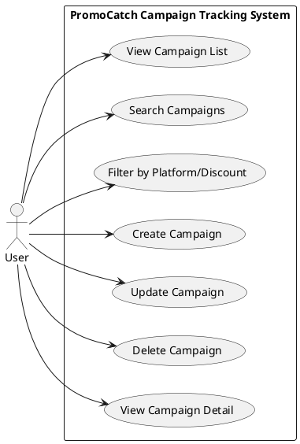
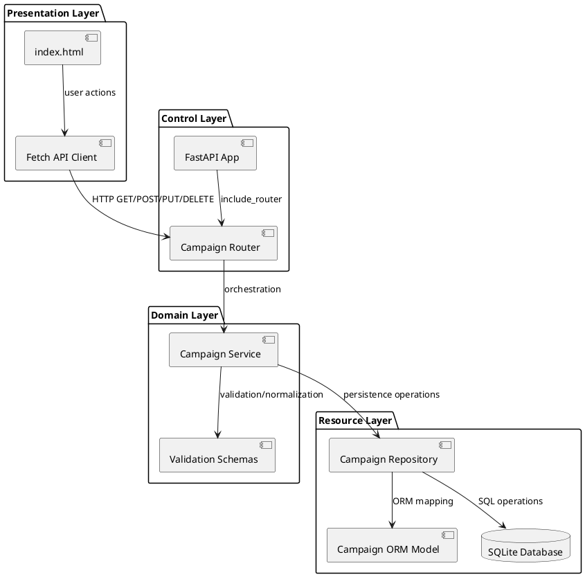
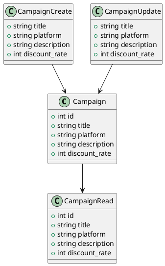
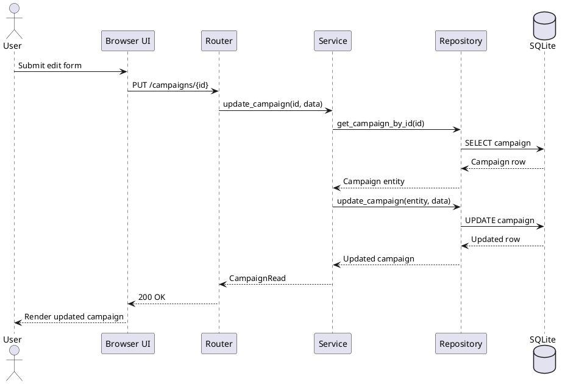
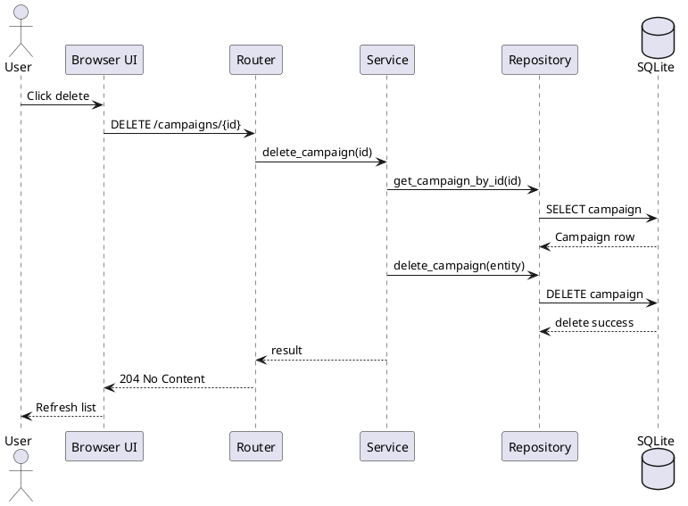
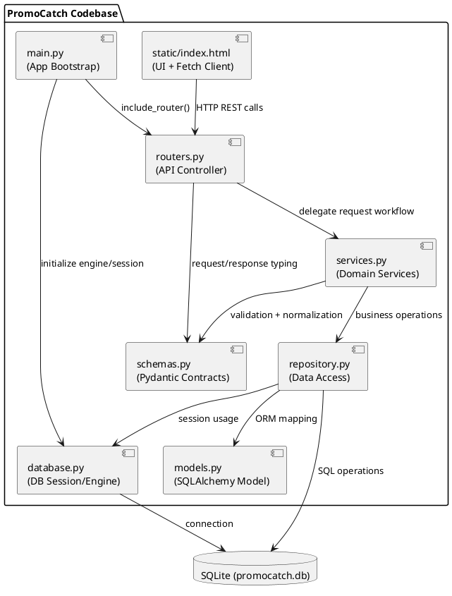
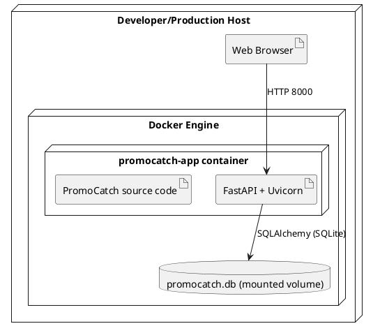

# Software Architecture Document V2

## Project Information

Project name: **PromoCatch - Campaign and Deal Tracking System**

Course context: **Software Architecture Project**

Phase: **Phase 2 - Architecture Completion and Full Implementation**

Deadline: **24.05.2026**

Architecture style: **Layered Architecture with REST API**

Technology stack:

- Backend: Python, FastAPI, SQLAlchemy
- Database: SQLite
- Frontend: HTML, CSS, Bootstrap, Vanilla JavaScript
- Deployment: Docker, Docker Compose, Uvicorn

---

## Phase 2 Step 1: Extended SAD (Version 2)

### 1) Completed Use Case View

Actors:

- **User**: tracks, searches, creates, edits, and deletes campaigns
- **System**: validates data, persists campaign records, and serves API responses

Completed use cases:

1. **View Campaign List**
2. **Search Campaigns**
3. **Filter Campaigns by Platform and Discount**
4. **Create Campaign**
5. **Update Campaign**
6. **Delete Campaign**
7. **View Campaign Detail**

Use case diagram:



Primary flow (search and create):

1. User opens PromoCatch.
2. Frontend requests `GET /campaigns` with optional query parameters.
3. API returns filtered campaign list.
4. User fills form and submits campaign.
5. Frontend sends `POST /campaigns`.
6. API validates payload and stores campaign.
7. Frontend refreshes list and displays updated state.

Alternative flow (update/delete):

1. User opens a campaign in edit mode.
2. Frontend sends `PUT /campaigns/{campaign_id}` for updates.
3. API validates and updates the campaign.
4. User can remove campaign with `DELETE /campaigns/{campaign_id}`.
5. API removes row and returns success response.

---

### 2) Completed Logical View

Layered logical structure:

- **Presentation Layer**: `static/index.html`
- **Control Layer**: `main.py`, `routers.py`
- **Domain Layer**: `schemas.py`, `services.py`
- **Resource Layer**: `database.py`, `models.py`, `repository.py`

Extended component diagram:



Domain model:



---

### 3) Completed Process View

#### Runtime behavior

- Browser and backend communicate synchronously over HTTP.
- Router orchestrates requests and delegates business processing to services.
- Services normalize payloads and enforce domain rules before repository calls.
- Repository performs all SQLAlchemy database access operations.

#### Sequence - update campaign flow



#### Sequence - delete campaign flow



---

### 4) Development View

Module organization:

```text
PromoCatch/
  main.py
  routers.py
  services.py
  schemas.py
  repository.py
  models.py
  database.py
  static/
    index.html
  README.md
  SAD_Phase1.md
  SAD_Phase2.md
  requirements.txt
  Dockerfile
  docker-compose.yml
```

Module responsibilities:

- `main.py`: application startup, table creation, static UI serving
- `routers.py`: REST endpoint definitions and HTTP contract
- `services.py`: domain logic, normalization, and workflow handling
- `repository.py`: database queries and persistence
- `schemas.py`: request/response contracts with validation
- `static/index.html`: complete UI behavior for full campaign management

Development view UML component diagram:



---

### 5) Deployment View

#### Target environment

- **Container 1 (app)**: FastAPI + Uvicorn runtime
- **Persistent storage**: SQLite file mounted as a volume
- **Client access**: Browser via `http://localhost:8000`

Deployment diagram:



Deployment strategy:

1. Build image from `Dockerfile`.
2. Start service with `docker compose up --build`.
3. Access UI at `http://localhost:8000`.
4. Persist `promocatch.db` through host volume mapping.

---

## Phase 2 Step 2: Implementation (Version 2)

Completed implementation in this version:

- Full frontend flows: list, search, filter (including min-max discount range), create, update, and delete campaign.
- Full backend REST API flows: `GET`, `GET by id`, `POST`, `PUT`, and `DELETE`.
- Filter-based querying using search text, platform, and discount criteria.
- Integer-only discount policy (`discount_rate` is 1-100) with fast UI controls (preset buttons and slider).
- Layered architecture preserved with clear separation of responsibilities.
- Deployment-ready container setup using `Dockerfile` and `docker-compose.yml`.

---

## Team Member Contributions

| Team Member | Contribution |
| --- | --- |
| Cemil Tekin | Extended SAD V2 architecture and implementation alignment, backend/full-stack integration |
| Kaan Kesen | SAD structure review, diagrams and documentation organization |
| Ömer Tarık Çandır | Frontend implementation completion and API integration testing |
